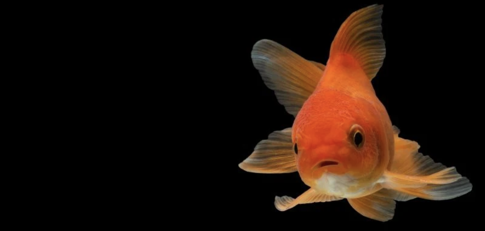

# prapti

Major project related stuff 
form prapti&co.

## Requirements

- Python 2.7 or Python 3
- OpenCV python module (cv2)
- flask 

## RUN
 
# For fusion 
- cd exposureFusion -> pyhton example.py
- cd Flask1 -> python one.py

## Goldfish Images

